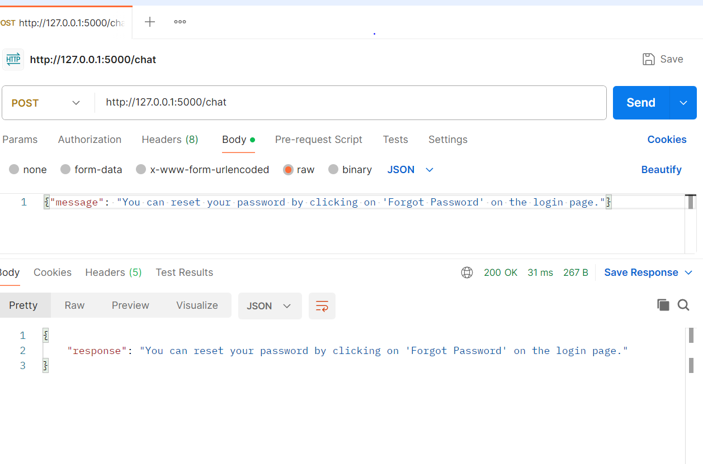

# Customer Service Chatbot

This project implements a customer service chatbot designed to answer frequently asked questions (FAQs) and assist users with simple customer service tasks. The chatbot leverages advanced NLP techniques and provides a web interface for user interaction.

## Tech Stack

- **Language**: Python
- **Frameworks/Libraries**: Flask (for backend), TensorFlow/Keras (for model training), nltk/Spacy (for NLP preprocessing)
- **Cloud Platform**: AWS Elastic Beanstalk or Google Cloud Run
- **Database**: SQLite or Firebase for storing FAQs

## Features

- **FAQ Handling**: Loads and processes FAQ data to provide relevant answers.
- **Advanced NLP**: Integrates Hugging Face transformers (BERT) for enhanced natural language understanding.
- **Web Interface**: A user-friendly HTML interface for interacting with the chatbot.
- **User Authentication**: Secures API access with token-based authentication.
- **Logging**: Tracks user interactions for monitoring and debugging purposes.

## Project Structure
